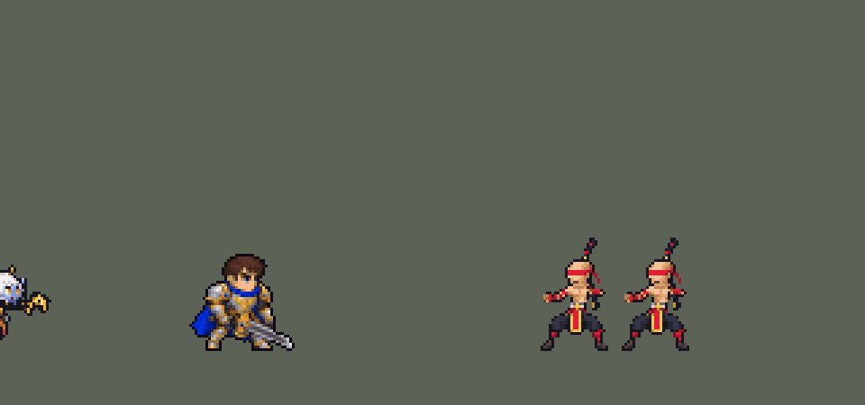
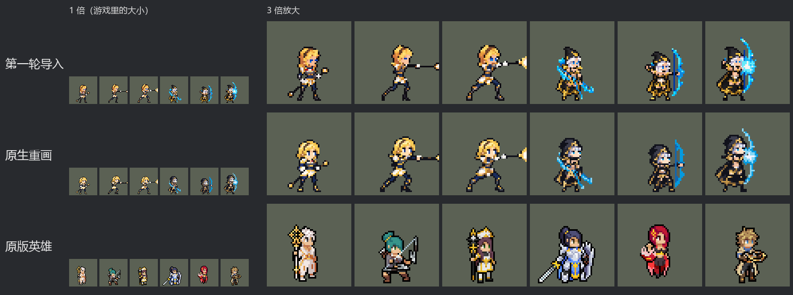

# TFM2-League-Heroes

团战经理2（Teamfight Manager 2）的英雄联盟英雄 Mod，mod_id 是 `league`。纯数据 mod：不改游戏本体，不需要编译。

英雄：盖伦（`league_garen`）、艾希（`league_ashe`）、拉克丝（`league_lux`）、李青（`league_leesin`）、索拉卡（`league_soraka`）。第一组（上单、打野、中单、ADC、辅助各一）齐了。




## 英雄：盖伦

技能按创意工坊 *League of Legends Reborn* 的做法处理。团战经理2 只有「技能1、技能2、大招」三个技能位，所以大招放 R，两个技能位放最有代表性的两个小技能，剩下的小技能和被动合并进去。

| 部分 | 内容 |
|---|---|
| 技能1 | Q「致命打击」：加速；下一次普攻变成跃起重击并沉默目标。合并 W「勇气」：减伤、韧性、护盾 |
| 技能2 | E「审判」：旋转 3 秒，边转边追着目标走，共 7 次伤害，最后一次降低护甲。被动「坚韧」：高生命回复 |
| 大招 | R「德玛西亚正义」：巨剑从天而降，造成真实伤害 |
| 精灵图 | 9 个动作 56 帧：待机、走路、普攻、Q 跃斩、战吼、E 旋转、R 施放、受击、死亡。身高约 36 px（原版人类英雄约 31 px），和原版一样是 Q 版大头（头约占身高 1/3），脸和眼睛在游戏里看得清。全部是正面 3/4 朝右，同一套造型和大小；除战吼和受击外，都按英雄联盟原版动作重画 |
| 特效 | 命中火花、Q 重击与沉默、Q 强化光环、W 护盾、E 剑风、R 天降巨剑 |
| 图标 | 官方技能图标（Q / E / R），从本地客户端提取，缩到 64×64 |
| 音频 | 从本地客户端提取的 9 条技能音效和 4 条中文语音。版权属于 Riot Games，**不提交到仓库**，按下面的命令在本地生成 |

### 从本地英雄联盟提取音频和图标

```bash
python tools/lol/extract_garen.py --lol "D:\WeGameApps\lol" --vgmstream "<vgmstream-cli.exe 路径>"
```

- 需要 Python 3.14（自带 zstd 解压），以及 `pip install pillow numpy`。
- `.wem` 音频要用 [vgmstream](https://github.com/vgmstream/vgmstream) 解码。
- 中文语音来自国服（WeGame）客户端的 `Garen.zh_CN.wad.client`。
- 只读取游戏文件，不修改。

`tools/lol/pose_ref.py` 从客户端读取英雄的模型、骨骼和动画，渲染真实动作的关键帧（3/4 视角朝右），作为 GPT 生图时的姿势参考。渲染图是 Riot 的模型，只在本地用，不入库。

`tools/lol/riot.py` 负责：
- 读取 WAD 包。
- 解析 Wwise 音频包。
- 把 `Play_sfx_Garen_...` 这类事件名对应到具体的音频文件。

以后做别的英雄也能直接用。

### 美术：GPT 生成，再导入成像素图

原图在 [`assets/source/garen/`](assets/source/garen/)。角色图是和艾希同一批的 Q 版重画，提示词见 [`CHIBI_REDRAW.md`](assets/source/CHIBI_REDRAW.md)，生成记录在 [`assets/source/chibi/`](assets/source/chibi/)；特效图和之前几轮的提示词见 [`PROMPTS.md`](assets/source/garen/PROMPTS.md)。

```bash
pip install pillow numpy
python tools/art/import_garen.py          # 写出 league/champions 和 league/effects 里的精灵图
python tools/art/preview_garen.py         # 写出 docs/preview 里的预览图和演示动图
```

导入脚本做这些事：
- 切帧：按空白列切开，连在一起的剑、光效整块归到同一帧。
- 缩放：每张图单独缩放，保证头一样大（GPT 每张图的头身比略有出入，按身高对齐会让头忽大忽小）。
- 对齐：脚底统一放在帧中心下方 11.5 px（和原版一致）。待机、战吼、受击按腿部和待机第一帧对齐；照英雄联盟动作画的走路、普攻、Q、R、死亡，按原版骨骼里头部的位置摆放（`pose_ref.py --track`）；普攻、Q、R 的前冲保留约 70%，免得收招时弹回待机太明显；E 旋转按两脚中点固定。
- 像素化：硬边、共享 64 色调色板、1 px 黑描边。
- 头像截取点（`champion_view` 的 `face`）用 `tfm2_ase.py face` 按原版英雄的规律定在头顶，`lint_mod.py` 会检查。

通用部分在 skill 的 `scripts/strips.py`，以后做别的英雄可以直接用。

逐帧预览：[`docs/preview/league_garen_frames.png`](docs/preview/league_garen_frames.png)，特效：[`docs/preview/league_garen_effects.png`](docs/preview/league_garen_effects.png)。

## 英雄：艾希

| 部分 | 内容 |
|---|---|
| 普攻 | 冰霜箭。被动「冰霜射击」：普攻减速 |
| 技能1 | Q「射手的专注」：4 秒内攻速提高；期间普攻换成英雄联盟里 Q 的连射姿势，伤害更高、减速更强 |
| 技能2 | W「万箭齐发」：向目标方向扇形射出 9 支冰霜箭，范围内每个敌人受到一次伤害并减速。数据里没有扇形判定，用的是矩形范围技能（`LineRangeProjectile`，长 80、宽 45），画面上是扇形箭雨 |
| 大招 | R「魔法水晶箭」：远距离直线飞行，眩晕第一个命中的敌方英雄，并在命中处炸开，减速周围敌人 |
| 去掉 | E「鹰击长空」：侦察视野，团战经理2 没有战争迷雾 |
| 精灵图 | 9 个动作 56 帧：待机、跑步、普攻、Q 连射、Q 发动、W、R、受击、死亡。身高 34 px（含兜帽），和原版一样是 Q 版大头，兜帽不遮脸，蓝眼睛在游戏里看得见。全部正面 3/4 朝右，同一套造型；除受击外，每个动作都按英雄联盟原版动画的时间点渲染姿势参考后生成，首尾帧是原版「待机 ↔ 动作」的过渡姿势。之后按游戏原尺寸重画了一次（18 色，见[下文](#按游戏原尺寸重画拉克丝艾希)） |
| 特效 | 冰霜箭、W 扇形箭雨（用冰霜箭按 9 个角度拼成：GPT 画的扇形只有 8 支箭、箭长不一，没采用）、Q 连射、命中冰花、Q 专注光环、R 水晶箭、R 命中冰冻 |
| 图标 | 官方技能图标（Q / W / R），从本地客户端提取，缩到 64×64 |
| 音频 | 从本地客户端提取的 9 条技能音效和 2 条中文语音（Q、W；国服语音包里 R 没有语音）。不提交到仓库，按下面的命令在本地生成 |

```bash
python tools/lol/extract_ashe.py --lol "D:\WeGameApps\lol" --vgmstream "<vgmstream-cli.exe 路径>"
python tools/art/import_ashe.py           # 特效：原图在 assets/source/ashe/，提示词见 ashe/PROMPTS.md
python tools/art/import_native.py --hero ashe   # 角色图：按游戏原尺寸重画的版本，在 assets/source/native/
python tools/art/preview_ashe.py
```

第一轮的角色图（提示词见 [`CHIBI_REDRAW.md`](assets/source/CHIBI_REDRAW.md)）细节很多：细长的冰晶弓、黑兜帽上的白发。按面积平均缩小会糊成一片土黄色，所以当时每个游戏像素只从共享调色板里选一个颜色：覆盖面积最大的那个，冰蓝、白发、肤色、金色的权重加大（`strips.render_vote`）。即便这样，游戏里还是碎成杂色点，后来按游戏原尺寸重画了（见下文）。`import_ashe.py --body` 仍能写出第一轮的角色图。

逐帧预览：[`docs/preview/league_ashe_frames.png`](docs/preview/league_ashe_frames.png)，特效：[`docs/preview/league_ashe_effects.png`](docs/preview/league_ashe_effects.png)。

## 英雄：拉克丝

| 部分 | 内容 |
|---|---|
| 普攻 | 法杖射出光弹。被动「光芒四射」：技能命中敌人后 5 秒内，下一次普攻引爆光芒，追加魔法伤害。团战经理2 只能判断施法者自己身上的状态，所以引爆的是下一个被普攻的敌人；敌人身上的光芒标记是命中时播放的特效 |
| 技能1 | Q「光之束缚」：直线光球，路径上的敌人受到魔法伤害并被禁锢 1.5 秒（英雄联盟里最多命中 2 个，数据里的直线投射物只有「穿透 / 不穿透」，没有命中数量）。合并 W「曲光屏障」：施放时拉克丝和身边的友方英雄获得护盾 |
| 技能2 | E「透光奇点」：抛出光球，落地后形成光圈，圈内敌人减速 40%，1 秒后自动引爆（AI 不会手动二次引爆） |
| 大招 | R「终极闪光」：跃起悬空，法杖浮在身前蓄力，约 0.5 秒后发射长 240 的激光，直线上所有敌人受到魔法伤害 |
| 精灵图 | 8 个动作 51 帧：待机、跑步、普攻、Q、E、R、受击、死亡。身高 34 px，Q 版大头（头约占身高 1/3），蓝眼睛在游戏里看得清。全部正面 3/4 朝右；除受击外，每个动作都按英雄联盟原版动画的时间点渲染大头姿势参考后生成：R 里法杖离手悬在身前、发射后空中蜷身再落地，死亡被击飞后仰面倒地。之后按游戏原尺寸重画了一次（19 色，见[下文](#按游戏原尺寸重画拉克丝艾希)） |
| 特效 | 光弹、命中、Q 光球和定身光环、W 彩虹护盾、E 光球和地面光圈（引爆）、R 激光（预警线、蓄力、光束、消散）、光芒标记和引爆 |
| 图标 | 官方技能图标（Q / E / R），从本地客户端提取，64×64 |
| 音频 | 从本地客户端提取的 11 条技能音效和 3 条中文语音（Q、E、R）。不提交到仓库，按下面的命令在本地生成 |

```bash
python tools/lol/extract_lux.py --lol "D:\WeGameApps\lol" --vgmstream "<vgmstream-cli.exe 路径>"
python tools/art/import_lux.py            # 特效：原图和提示词在 assets/source/lux/
python tools/art/import_native.py --hero lux    # 角色图：按游戏原尺寸重画的版本，在 assets/source/native/
python tools/art/preview_lux.py
```

拉克丝从第一轮就按 Q 版比例生成：造型图附本包的盖伦、艾希和原版法系英雄对照图，姿势参考图本身就是大头比例，造型图检查通过后才批量生成动作。第一轮导入时：
- 每张动作图按头的大小缩放：待机的头在各帧上按不同比例做相关匹配，同一张图里可靠的匹配相差不到 3%。
- R 的法杖离手后越过了等宽格子的边界，按连通块切帧：含深蓝紧身衣的块是身体，其他块（法杖、光芒）归给左边最近的身体。
- 原地播放的特效按格子中心对齐（GPT 把每帧画在等宽格子的正中，偏差不超过 8 px）。
- 激光按判定长度 240 px 缩放，从拉克丝身前 6 px 开始。游戏把激光画在单位中心的高度，R 里悬浮的法杖离地约 14 px，正好在光束里。

后来角色图按游戏原尺寸重画了（见下文），每帧的位置沿用第一轮，所以法杖仍在光束里。`import_lux.py --body` 仍能写出第一轮的角色图。

跑步第 4、5、7、8 帧的下半身像变了形：英雄联盟里拉克丝跑到后半段把法杖竖在身后，杖尾垂到后脚边，游戏尺寸下金白色的杖尾和后腿粘在一起，看起来像一只金色的脚。这四帧的杖尾改画成和其他帧一样的深色靴子（杖尾算作被腿挡住），逐像素记在 [`native/lux_retouch.json`](assets/source/native/lux_retouch.json)，导入时套用。

逐帧预览：[`docs/preview/league_lux_frames.png`](docs/preview/league_lux_frames.png)，特效：[`docs/preview/league_lux_effects.png`](docs/preview/league_lux_effects.png)。

## 英雄：李青

| 部分 | 内容 |
|---|---|
| 定位 | 刺客（Assassin），第一组里的打野 |
| 普攻 | 出拳。被动「疾风骤雨」：每次施放技能后，3 秒内接下来 2 次普攻攻速 +40%（两个 buff 计数，模板里"第 N 次普攻"的写法） |
| 技能1 | Q「天音波 / 回音击」：音波命中第一个敌人，造成物理伤害并留下印记；0.2 秒后李青自动飞踢冲到它身边再打一次。英雄联盟里二段是手动的，还按已损失生命加伤；这里自动冲、固定数值 |
| 技能2 | E「天雷破 / 摧筋断骨」：跃起捶地，周围敌人受到物理伤害并减速 40%。合并 W「金钟罩 / 铁布衫」：李青和身边的友方英雄获得护盾，李青获得 20% 吸血。W 原本要冲向友方，这里取消冲刺，免得 AI 被拉离战斗 |
| 大招 | R「猛龙摆尾」：回旋踢把目标踢飞约 54 px；一条金龙以同样速度跟在它后面，沿途撞到的敌人受到伤害并被击飞 0.75 秒 |
| 精灵图 | 9 个动作 58 帧：待机、跑步、普攻、Q1 推掌、Q2 飞踢、E 捶地、R 回旋踢、受击、死亡。身高 34 px（光头头顶到脚底，辫子另算），16 色；红色蒙眼布横过脸，盲僧不画眼睛。全部正面 3/4 朝右，按英雄联盟原版动作的时间点画：战斗待机每 0.75 秒下沉弹跳一次，跑步是大步腾跃（双脚离地约一半时间） |
| 特效 | 普攻命中、音波、音波印记、回音击命中、天雷破震波、金钟罩护盾、猛龙摆尾踢击、金龙、撞击击飞 |
| 图标 | 官方技能图标（Q / E / R），从本地客户端提取，64×64 |
| 音频 | 从本地客户端提取的 11 条技能音效和 4 条中文语音（Q、Q2、E、R）。不提交到仓库，按下面的命令在本地生成 |

```bash
python tools/lol/extract_leesin.py --lol "D:\WeGameApps\lol" --vgmstream "<vgmstream-cli.exe 路径>"
python tools/lol/native_pose.py assets/source/leesin/poses.json --out <参考图文件夹>
python tools/art/fit_native.py --hero leesin --src assets/source/leesin/codex --refs <参考图文件夹> --scale run=1.4 --scale attack=1.4 --scale skill=1.4 --scale skill2=1.34 --scale ult=1.38 --scale hit=1.38 --scale dead=1.35 --scale q2=1,1,1,1,1,1.18,1.18
python tools/art/import_native.py --hero leesin    # 角色图
python tools/art/import_leesin.py                  # 特效
python tools/art/preview_leesin.py
```

李青没有先画高清的第一轮，而是一开始就按游戏原尺寸画（提示词见 [`assets/source/leesin/PROMPTS.md`](assets/source/leesin/PROMPTS.md)）：
- `native_pose.py` 把英雄联盟客户端里的动作直接渲染成游戏尺寸的参考图（34 px，每个像素一个 8×8 方块），旁边配同一批帧的高清渲染。每帧的锚点和原版头部骨骼的位置记在 [`native/leesin_cells.json`](assets/source/native/leesin_cells.json)。
- 先画原尺寸造型图，确认后同一批画 9 张动作和 9 张特效；Codex 整理成严格的 8×8 纯色块（交接记录在 [`leesin/codex/`](assets/source/leesin/codex/)）。
- 交回的动作里，除了待机，GPT 都画大了约 1.4 倍，头比身体放得更多；直接导入的话，李青一出招就会变大。`fit_native.py` 按头的大小把每张动作缩回造型图的比例（按 16 色投票取色，仍是纯色像素），再把每帧的蒙眼布对到原版头部骨骼的位置，着地的帧脚底压在地面线上。待机是 Codex 用确认过的造型图分层重组的，原样使用。
- 结果：16 色，和右边像素同色的比例 37%（原版英雄 18%–46%）；头像截取点 (0, −34)。
- 进游戏看过后改了嘴和鼻子：造型图脸前缘那条深色竖线和下巴上的深色块去掉，换成蒙眼布下方两行处 2 格的嘴；头部直立的动作帧套用同一张下半脸。待机的头右侧原来是一条直边，在深色的英雄卡片上看起来像被切掉一半，改成了弧形轮廓（额头、蒙眼布、鼻尖外凸，嘴和下巴内收）。改动逐像素记在 [`native/leesin_retouch.json`](assets/source/native/leesin_retouch.json)，导入时套用。

逐帧预览：[`docs/preview/league_leesin_frames.png`](docs/preview/league_leesin_frames.png)，特效：[`docs/preview/league_leesin_effects.png`](docs/preview/league_leesin_effects.png)。

## 英雄：索拉卡

| 部分 | 内容 |
|---|---|
| 定位 | 辅助（Util），第一组里的辅助，也是本包第一个治疗 |
| 普攻 | 法杖射出星光弹，造成 100% 攻击力的物理伤害 |
| 技能1 | Q「流星坠落」：星星砸向敌方英雄所在的位置，0.4 秒后落地，范围魔法伤害并减速 30%。命中敌方英雄时获得「活力焕发」：回血并加移速，每次施放只触发一次。合并 E「星体结界」：每 16 秒最多一次，星星落地后留下星之领域，沉默圈内敌人，1.5 秒后仍在圈里的被禁锢 1 秒并受到伤害。英雄联盟里 E 是单独的技能；这里没有第三个技能位，就跟着 Q 落下，用一个隐藏的冷却 buff 保留原版 8 秒 / 16 秒的节奏 |
| 技能2 | W「星之灌注」：扣自己 8% 最大生命，治疗一名其他友方英雄；带有活力焕发时消耗减半，目标也加移速。扣血前先加 3 tick 的不死 buff，不会把自己扣死。合并被动「拯救」：放完后 2 秒内移速 +30%（数据读不到移动方向和友方血量，近似成治疗后赶去支援） |
| 大招 | R「祈愿」：治疗全图所有友方英雄，包括自己。原版对生命低于 40% 的目标加成治疗，数据做不到，统一数值 |
| 治疗给谁 | W 用 `AllyNotSelf`（除自己以外的友方英雄，不含小兵），R 用 `AllyChampion` 加全图范围。游戏 AI 给友方技能打分时，治疗的价值是"治疗量和目标缺失生命取小"，所以应该会先治疗掉血最多的友方，满血时价值为 0。这是从 mod SDK 的代码里读出来的，还没进游戏验证 |
| 精灵图 | 8 个动作 52 帧：待机、跑步、普攻、Q 召唤流星、W 举杖、R 祈愿鞠躬、受击、死亡。白发顶到蹄底 35 px，17 色，全部正面 3/4 朝右，按英雄联盟原版动作的时间点画：待机 1.5 秒呼吸一次，跑步是蹄子着地的蹦跳式跑 |
| 特效 | 普攻星光弹、命中、流星坠落、活力焕发、星体结界、定身光环、星之灌注、祈愿（头顶的星和落在每个友方身上的光柱） |
| 图标 | 官方技能图标（Q / W / R），64×64 |
| 音频 | 从本地客户端提取的 10 条技能音效和 2 条中文语音（Q 借一句攻击台词，R）。不提交到仓库，按下面的命令在本地生成 |

```bash
python tools/lol/extract_soraka.py --lol "D:\WeGameApps\lol" --vgmstream "<vgmstream-cli.exe 路径>"
python tools/lol/native_pose.py assets/source/soraka/poses.json --out <参考图文件夹>
python tools/art/import_native.py --hero soraka    # 角色图（套用 soraka_retouch.json）
python tools/art/import_soraka.py                  # 特效
python tools/art/preview_soraka.py
```

美术和李青一样直接按游戏原尺寸画（提示词见 [`assets/source/soraka/PROMPTS.md`](assets/source/soraka/PROMPTS.md)）：
- 她的角在模型里没有自己的蒙皮权重，是跟着头走的，头放大 2 倍时角也变成 2 倍、成了最高点。`native_pose.py` 的 `keep` 把角的顶点绑到 `horn` 骨骼上，让它保持原版长度；长马尾挂在胸部骨骼下，本来就不随头放大。
- 造型图 Codex 画了三版：第一版是没整理的模糊图，第二版变成正面站姿、眼睛像两块白斑，第三版通过；嘴去掉，眼睛由用户调亮。
- Codex 把造型图的头逐格贴进了每一帧，头的大小一致，待机和跑步不抖。交回后用户发现头发只盖住头顶和后脑，额头和右半边都是蓝色皮肤，脸显得很大：所有帧的头统一加了刘海和右侧一缕发丝（每帧 14 个像素，造型图同步）。Q 第 2–3 帧法杖和手分开了，补上握杖的手臂，删掉 GPT 留下的碎块和闪光。改动逐像素记在 [`native/soraka_retouch.json`](assets/source/native/soraka_retouch.json)，导入时套用。
- 结果：17 色，和右边像素同色的比例 30%（原版英雄 18%–46%）；头像截取点 (5, −35)。
- 特效放大 2 倍后，流星落地环和星体结界约 60 px 宽，所以 Q、E 的半径定为 30000（和拉克丝的 E 一样）。

逐帧预览：[`docs/preview/league_soraka_frames.png`](docs/preview/league_soraka_frames.png)，特效：[`docs/preview/league_soraka_effects.png`](docs/preview/league_soraka_effects.png)。

## 按游戏原尺寸重画（拉克丝、艾希）

第一轮的问题：GPT 画的像素画里，角色约 100 个像素块高，游戏里只有 34 px，导入时要 3 个块并成 1 个像素。盖伦是大块铠甲，压完还认得出。拉克丝、艾希身上发丝、饰边、细弓、细杖多，压完成了一粒粒杂色，游戏里一片糊。

所以角色图让 GPT 按游戏尺寸重画了一次，提示词见 [`NATIVE_REDRAW.md`](assets/source/NATIVE_REDRAW.md)：
- 参考图是现在游戏里的每一帧，放大 8 倍：姿势、大小、位置都已经对了。
- 附原版英雄的 8 倍对照图。
- 要求 34 像素高，每个像素画成一个 8×8 的方块，20 色以内，大块平涂，眼睛每只 2×2 个方块。
- 先出两张造型图，检查通过后，再同一批出 17 张动作图。

原图和 Codex 的整理记录在 [`assets/source/native/`](assets/source/native/)。

导入（`tools/art/import_native.py`）：
- 每个方块读成一个游戏像素，不再缩放、不再配色。
- 按出参考图时记下的锚点（`<英雄>_cells.json`）放回第一轮每一帧的位置：头部轨迹、前冲、R 的法杖高度、死亡击飞都沿用。
- 待机和跑步里每帧的头对齐到同一列，去掉 1–2 像素的抖动。

| 待机第 1 帧 | 原版英雄（15 个） | 第一轮 艾希 / 拉克丝 | 重画后 艾希 / 拉克丝 |
|---|---|---|---|
| 颜色数 | 16–33 | 42 / 41 | 18 / 18 |
| 和右边像素同色的比例 | 18%–46%，中位 32% | 15% / 18% | 31% / 29% |



## 安装测试

把 `league` 文件夹复制到 `Teamfight Manager2/mods/league`，在游戏的 Mods 菜单里启用。音频要先按上面的命令在本地提取。

## 仓库里的 skill

`.claude/skills/tfm2-hero-mod/` 是一个团战经理2英雄 mod 开发 skill。在本仓库里用 Claude Code 时会自动加载。

| 路径 | 内容 |
|---|---|
| `SKILL.md` | 英雄从数据到上架的完整流程，以及防止"静默失效"的硬规则 |
| `references/mod-structure.md` | mod 文件结构、`mod.mod_info` / `mod.override_info`、资源路径、本地测试、官方上传器 |
| `references/champion-data.md` | `.data_champion` 全字段、时间和距离单位、官方英雄的属性和冷却区间、54 种可用效果类型、buff 字段、特效绑定、常用写法 |
| `references/art-spec.md` | 像素画规范（实测数据）、动画 tag 和帧时长、锚点、特效和图标风格、AI 生成图的导入方法、QA 清单 |
| `references/text-audio.md` | 多语言文本、富文本颜色和图标、`champion_view`、音效 |
| `references/porting-heroes.md` | 把 LoL、Dota 的技能移植到 TFM2：机制对照表、选英雄评分法、LoL 客户端文件提取 |
| `references/workshop-page.md` | 创意工坊页面模板：缩略图、演示动图、收藏页、简介、更新说明 |
| `scripts/lint_mod.py` | 整包校验：路径、动画 tag、特效绑定、文本 key、音效注入、override 目标等 |
| `scripts/tfm2_ase.py` | 精灵图查看、预览和量化：身高、描边、颜色数、半透明像素等 |
| `scripts/strips.py` | 把 AI 生成的动作条导入成游戏精灵图：切帧、对齐、像素化、调色板、描边、导出 |
| `scripts/bundle_tool.py` | 只读浏览游戏本体资源：可引用的原版特效、音效名、官方英雄数据 |
| `templates/mymod/` | 可直接复制的示例 mod，已通过校验 |

## 快速开始

```bash
pip install pillow numpy
python .claude/skills/tfm2-hero-mod/scripts/lint_mod.py league
python .claude/skills/tfm2-hero-mod/scripts/tfm2_ase.py metrics <英雄>.aseprite
python .claude/skills/tfm2-hero-mod/scripts/bundle_tool.py sfx --grep fighter
```

脚本会在常见的 Steam 路径里找游戏。找不到时加上 `--game "<Teamfight Manager2 目录>"`，或者设置环境变量 `TFM2_GAME_DIR`。

在别的项目里也想用这个 skill：把 `.claude/skills/tfm2-hero-mod` 复制到 `~/.claude/skills/`。其他支持 SKILL.md 格式的工具，复制到它们各自的 skills 目录即可。

## 知识来源

- 游戏本体：68 个官方英雄的数据、78 套官方精灵图、官方上传器
- 创意工坊高分英雄包：oppi 等人的 *League of Legends Reborn*（3774304166）和 *Dota 2 Heroes*（3770621310），以及 *Touhou Project*

文档里的数字都是实测的。只靠推断得出的结论会标 *(inferred)*。

## 声明

非商业粉丝作品。英雄联盟及其角色、音频、图标版权归 Riot Games 所有，团战经理2 版权归其开发商所有。
