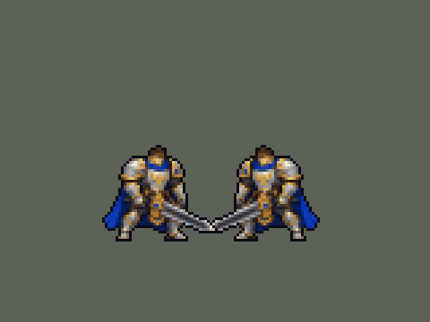
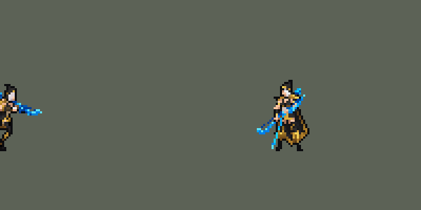

# TFM2-League-Heroes

团战经理2（Teamfight Manager 2）的英雄联盟英雄 Mod，mod_id 是 `league`。纯数据 mod：不改游戏本体，不需要编译。

英雄：盖伦（`league_garen`）、艾希（`league_ashe`）。





## 英雄：盖伦

技能按创意工坊 *League of Legends Reborn* 的做法处理。团战经理2 只有「技能1、技能2、大招」三个技能位，所以大招放 R，两个技能位放最有代表性的两个小技能，剩下的小技能和被动合并进去。

| 部分 | 内容 |
|---|---|
| 技能1 | Q「致命打击」：加速；下一次普攻变成跃起重击并沉默目标。合并 W「勇气」：减伤、韧性、护盾 |
| 技能2 | E「审判」：旋转 3 秒，边转边追着目标走，共 7 次伤害，最后一次降低护甲。被动「坚韧」：高生命回复 |
| 大招 | R「德玛西亚正义」：巨剑从天而降，造成真实伤害 |
| 精灵图 | 9 个动作 56 帧：待机、走路、普攻、Q 跃斩、战吼、E 旋转、R 施放、受击、死亡。身高约 36 px（原版人类英雄约 31 px），和原版一样是 Q 版大头（头约占身高 1/3），脸和眼睛在游戏里看得清。全部是正面 3/4 朝右，同一套造型和大小；除战吼和受击外，都按英雄联盟原版动作重画 |
| 特效 | 命中火花、Q 重击与沉默、Q 强化光环、W 护盾、E 剑风、R 天降巨剑 |
| 图标 | 官方技能图标（Q / E / R），从本地客户端提取，缩到 64×64 |
| 音频 | 从本地客户端提取的 9 条技能音效和 4 条中文语音。版权属于 Riot Games，**不提交到仓库**，按下面的命令在本地生成 |

### 从本地英雄联盟提取音频和图标

```bash
python tools/lol/extract_garen.py --lol "D:\WeGameApps\lol" --vgmstream "<vgmstream-cli.exe 路径>"
```

- 需要 Python 3.14（自带 zstd 解压），以及 `pip install pillow numpy`。
- `.wem` 音频要用 [vgmstream](https://github.com/vgmstream/vgmstream) 解码。
- 中文语音来自国服（WeGame）客户端的 `Garen.zh_CN.wad.client`。
- 只读取游戏文件，不修改。

`tools/lol/pose_ref.py` 从客户端读取英雄的模型、骨骼和动画，渲染真实动作的关键帧（3/4 视角朝右），作为 GPT 生图时的姿势参考。渲染图是 Riot 的模型，只在本地用，不入库。

`tools/lol/riot.py` 负责：
- 读取 WAD 包。
- 解析 Wwise 音频包。
- 把 `Play_sfx_Garen_...` 这类事件名对应到具体的音频文件。

以后做别的英雄也能直接用。

### 美术：GPT 生成，再导入成像素图

原图在 [`assets/source/garen/`](assets/source/garen/)。角色图是和艾希同一批的 Q 版重画，提示词见 [`CHIBI_REDRAW.md`](assets/source/CHIBI_REDRAW.md)，生成记录在 [`assets/source/chibi/`](assets/source/chibi/)；特效图和之前几轮的提示词见 [`PROMPTS.md`](assets/source/garen/PROMPTS.md)。

```bash
pip install pillow numpy
python tools/art/import_garen.py          # 写出 league/champions 和 league/effects 里的精灵图
python tools/art/preview_garen.py         # 写出 docs/preview 里的预览图和演示动图
```

导入脚本做这些事：
- 切帧：按空白列切开，连在一起的剑、光效整块归到同一帧。
- 缩放：每张图单独缩放，保证头一样大（GPT 每张图的头身比略有出入，按身高对齐会让头忽大忽小）。
- 对齐：脚底统一放在帧中心下方 11.5 px（和原版一致）。待机、战吼、受击按腿部和待机第一帧对齐；照英雄联盟动作画的走路、普攻、Q、R、死亡，按原版骨骼里头部的位置摆放（`pose_ref.py --track`）；普攻、Q、R 的前冲保留约 70%，免得收招时弹回待机太明显；E 旋转按两脚中点固定。
- 像素化：硬边、共享 64 色调色板、1 px 黑描边。
- 头像截取点（`champion_view` 的 `face`）用 `tfm2_ase.py face` 按原版英雄的规律定在头顶，`lint_mod.py` 会检查。

通用部分在 skill 的 `scripts/strips.py`，以后做别的英雄可以直接用。

逐帧预览：[`docs/preview/league_garen_frames.png`](docs/preview/league_garen_frames.png)，特效：[`docs/preview/league_garen_effects.png`](docs/preview/league_garen_effects.png)。

## 英雄：艾希

| 部分 | 内容 |
|---|---|
| 普攻 | 冰霜箭。被动「冰霜射击」：普攻减速 |
| 技能1 | Q「射手的专注」：4 秒内攻速提高；期间普攻换成英雄联盟里 Q 的连射姿势，伤害更高、减速更强 |
| 技能2 | W「万箭齐发」：向目标方向扇形射出 9 支冰霜箭，范围内每个敌人受到一次伤害并减速。数据里没有扇形判定，用的是矩形范围技能（`LineRangeProjectile`，长 80、宽 45），画面上是扇形箭雨 |
| 大招 | R「魔法水晶箭」：远距离直线飞行，眩晕第一个命中的敌方英雄，并在命中处炸开，减速周围敌人 |
| 去掉 | E「鹰击长空」：侦察视野，团战经理2 没有战争迷雾 |
| 精灵图 | 9 个动作 56 帧：待机、跑步、普攻、Q 连射、Q 发动、W、R、受击、死亡。身高 34 px（含兜帽），和原版一样是 Q 版大头，兜帽不遮脸，蓝眼睛在游戏里看得见。全部正面 3/4 朝右，同一套造型；除受击外，每个动作都按英雄联盟原版动画的时间点渲染姿势参考后生成，首尾帧是原版「待机 ↔ 动作」的过渡姿势 |
| 特效 | 冰霜箭、W 扇形箭雨（用冰霜箭按 9 个角度拼成：GPT 画的扇形只有 8 支箭、箭长不一，没采用）、Q 连射、命中冰花、Q 专注光环、R 水晶箭、R 命中冰冻 |
| 图标 | 官方技能图标（Q / W / R），从本地客户端提取，缩到 64×64 |
| 音频 | 从本地客户端提取的 9 条技能音效和 2 条中文语音（Q、W；国服语音包里 R 没有语音）。不提交到仓库，按下面的命令在本地生成 |

```bash
python tools/lol/extract_ashe.py --lol "D:\WeGameApps\lol" --vgmstream "<vgmstream-cli.exe 路径>"
python tools/art/import_ashe.py           # 原图在 assets/source/ashe/；角色图提示词见 assets/source/CHIBI_REDRAW.md，特效见 ashe/PROMPTS.md
python tools/art/preview_ashe.py
```

艾希的原图细节很多（细长的冰晶弓、黑兜帽上的白发），按面积平均缩小会糊成一片土黄色。所以导入时每个游戏像素只从共享调色板里选一个颜色：选覆盖面积最大的颜色，冰蓝、白发、肤色、金色的权重加大（`strips.render_vote`）。描黑边时跳过弓身，否则细弓会整根变黑。

逐帧预览：[`docs/preview/league_ashe_frames.png`](docs/preview/league_ashe_frames.png)，特效：[`docs/preview/league_ashe_effects.png`](docs/preview/league_ashe_effects.png)。

## 安装测试

把 `league` 文件夹复制到 `Teamfight Manager2/mods/league`，在游戏的 Mods 菜单里启用。音频要先按上面的命令在本地提取。

## 仓库里的 skill

`.claude/skills/tfm2-hero-mod/` 是一个团战经理2英雄 mod 开发 skill。在本仓库里用 Claude Code 时会自动加载。

| 路径 | 内容 |
|---|---|
| `SKILL.md` | 英雄从数据到上架的完整流程，以及防止"静默失效"的硬规则 |
| `references/mod-structure.md` | mod 文件结构、`mod.mod_info` / `mod.override_info`、资源路径、本地测试、官方上传器 |
| `references/champion-data.md` | `.data_champion` 全字段、时间和距离单位、官方英雄的属性和冷却区间、54 种可用效果类型、buff 字段、特效绑定、常用写法 |
| `references/art-spec.md` | 像素画规范（实测数据）、动画 tag 和帧时长、锚点、特效和图标风格、AI 生成图的导入方法、QA 清单 |
| `references/text-audio.md` | 多语言文本、富文本颜色和图标、`champion_view`、音效 |
| `references/porting-heroes.md` | 把 LoL、Dota 的技能移植到 TFM2：机制对照表、选英雄评分法、LoL 客户端文件提取 |
| `references/workshop-page.md` | 创意工坊页面模板：缩略图、演示动图、收藏页、简介、更新说明 |
| `scripts/lint_mod.py` | 整包校验：路径、动画 tag、特效绑定、文本 key、音效注入、override 目标等 |
| `scripts/tfm2_ase.py` | 精灵图查看、预览和量化：身高、描边、颜色数、半透明像素等 |
| `scripts/strips.py` | 把 AI 生成的动作条导入成游戏精灵图：切帧、对齐、像素化、调色板、描边、导出 |
| `scripts/bundle_tool.py` | 只读浏览游戏本体资源：可引用的原版特效、音效名、官方英雄数据 |
| `templates/mymod/` | 可直接复制的示例 mod，已通过校验 |

## 快速开始

```bash
pip install pillow numpy
python .claude/skills/tfm2-hero-mod/scripts/lint_mod.py league
python .claude/skills/tfm2-hero-mod/scripts/tfm2_ase.py metrics <英雄>.aseprite
python .claude/skills/tfm2-hero-mod/scripts/bundle_tool.py sfx --grep fighter
```

脚本会在常见的 Steam 路径里找游戏。找不到时加上 `--game "<Teamfight Manager2 目录>"`，或者设置环境变量 `TFM2_GAME_DIR`。

在别的项目里也想用这个 skill：把 `.claude/skills/tfm2-hero-mod` 复制到 `~/.claude/skills/`。其他支持 SKILL.md 格式的工具，复制到它们各自的 skills 目录即可。

## 知识来源

- 游戏本体：68 个官方英雄的数据、78 套官方精灵图、官方上传器
- 创意工坊高分英雄包：oppi 等人的 *League of Legends Reborn*（3774304166）和 *Dota 2 Heroes*（3770621310），以及 *Touhou Project*

文档里的数字都是实测的。只靠推断得出的结论会标 *(inferred)*。

## 声明

非商业粉丝作品。英雄联盟及其角色、音频、图标版权归 Riot Games 所有，团战经理2 版权归其开发商所有。
