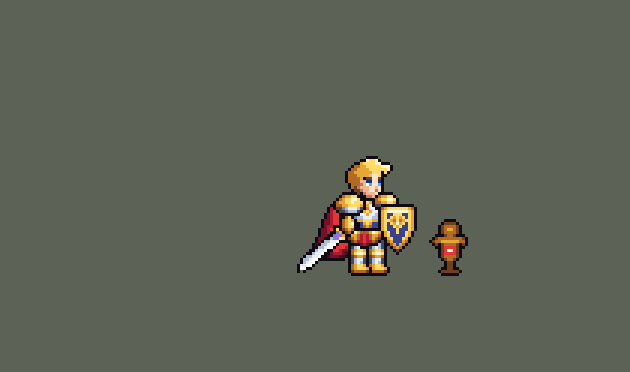

# Honor-of-Kings

团战经理2（Teamfight Manager 2）的王者荣耀英雄 Mod。纯数据 mod：不改游戏本体，不需要编译。

## 仓库里现在有什么

`.claude/skills/tfm2-hero-mod/` 是一个团战经理2英雄 mod 开发 skill。在本仓库里用 Claude Code 时会自动加载。

| 路径 | 内容 |
|---|---|
| `SKILL.md` | 英雄从数据到上架的完整流程，以及防止"静默失效"的硬规则 |
| `references/mod-structure.md` | mod 文件结构、`mod.mod_info` / `mod.override_info`、资源路径、本地测试、官方上传器 |
| `references/champion-data.md` | `.data_champion` 全字段、时间和距离单位、官方英雄的属性和冷却区间、54 种可用效果类型、buff 字段、特效绑定、常用写法 |
| `references/art-spec.md` | 像素画规范（实测数据）、动画 tag 和帧时长、锚点、特效和图标风格、QA 清单 |
| `references/text-audio.md` | 多语言文本、富文本颜色和图标、`champion_view`、音效 |
| `references/porting-heroes.md` | 把王者荣耀、LoL、Dota 的技能移植到 TFM2：机制对照表和选英雄评分法 |
| `references/workshop-page.md` | 创意工坊页面模板：缩略图、演示动图、收藏页、简介、更新说明 |
| `scripts/lint_mod.py` | 整包校验：路径、动画 tag、特效绑定、文本 key、音效注入、override 目标等 |
| `scripts/tfm2_ase.py` | 精灵图查看、预览和量化：身高、描边、颜色数、半透明像素等 |
| `scripts/bundle_tool.py` | 只读浏览游戏本体资源：可引用的原版特效、音效名、官方英雄数据 |
| `templates/mymod/` | 可直接复制的示例 mod，已通过校验 |

## 英雄：亚瑟（`hok_arthur`）



| 部分 | 内容 |
|---|---|
| 技能 | 普攻；一技能「誓约之盾」冲锋、沉默、强化普攻；二技能「回旋打击」三面火焰金盾环绕 5 秒；大招「圣剑裁决」跃击、击飞、留下圣印 |
| 精灵图 | `hok/champions/hok_arthur`：8 个动画、48 帧，身高 40 px，逐像素绘制；腿部始终保持同一形状和长度，迈步只让腿倾斜，不旋转、不压缩（金发、金甲大肩甲、红披风、狮面盾、银剑金护手） |
| 特效 | `hok/effects/`：普攻命中闪光、一技能金色十字斩、强化普攻斩击、火焰狮面盾环绕、圣剑光刃落地、地面圣印；挥剑刀光和手中光剑也在角色帧里。原图由 Codex（gpt-image-2）生成，放在 `assets/source/arthur_fx/`（含提示词），再转成游戏尺寸的硬边像素 |
| 图标 | `hok/icons/`：官方技能图标缩到 64×64 |
| 音频 | 官方语音 + 实录技能音效。版权属于腾讯，**不提交到仓库**，按下面的步骤在本地生成 |

所有帧见 [docs/preview/arthur_frames.png](docs/preview/arthur_frames.png)。

### 重新生成美术

```bash
pip install pillow numpy
python tools/art/arthur_anim.py   # 角色精灵图 hok/champions/hok_arthur#sheet.png + #anim.fanim
python tools/art/arthur_fx.py     # 特效 hok/effects/*
python tools/art/showcase.py      # 预览图 docs/preview/*
```

身体每个部件都是手写的像素网格（`tools/art/arthur_parts.py`）。`arthur_rig.py` 把部件摆成姿势，剑用 RotSprite 旋转。`arthur_anim.py` 定义每个动作的关键帧。

特效原图在 `assets/source/arthur_fx/`，由 `tools/art/import_fx.py` 处理：
- 按 `manifest.json` 切帧，同一张图的所有帧共用一个裁切框，保持锚点。
- 缩到游戏尺寸。
- 去掉半透明，只保留完全透明或完全不透明的像素。
- 统一到亚瑟的金色色阶。

`arthur_fx.py` 决定每个特效的大小、锚点、帧时长，并把火焰盾和伤害圈组合成二技能。换新图时，替换原图后重跑上面三条命令即可。

### 生成音频（不入库）

```bash
python tools/audio/fetch_official_audio.py              # 官方语音，从王者荣耀官网下载
ffmpeg -i 亚瑟录屏.mp4 -vn -ac 1 -ar 44100 rec.wav
python tools/audio/cut_recording_sfx.py rec.wav          # 从实机录屏切出 6 个技能音效
```

### 安装测试

把 `hok` 文件夹复制到 `Teamfight Manager2/mods/hok`。开新局时，在「英雄设置 / 选择起始英雄」里用亚瑟替换 001 格斗家。

## 快速开始

```bash
pip install pillow
python .claude/skills/tfm2-hero-mod/scripts/lint_mod.py <你的 mod 文件夹>
python .claude/skills/tfm2-hero-mod/scripts/tfm2_ase.py metrics <英雄>.aseprite
python .claude/skills/tfm2-hero-mod/scripts/bundle_tool.py sfx --grep fighter
```

脚本会在常见的 Steam 路径里找游戏。找不到时加上 `--game "<Teamfight Manager2 目录>"`，或者设置环境变量 `TFM2_GAME_DIR`。

在别的项目里也想用这个 skill：把 `.claude/skills/tfm2-hero-mod` 复制到 `~/.claude/skills/`。其他支持 SKILL.md 格式的工具，复制到它们各自的 skills 目录即可。

## 知识来源

- 游戏本体：68 个官方英雄的数据、78 套官方精灵图、官方上传器
- 创意工坊高分英雄包：oppi 等人的 *League of Legends Reborn*（3774304166）和 *Dota 2 Heroes*（3770621310），以及 *Touhou Project*

文档里的数字都是实测的。只靠推断得出的结论会标 *(inferred)*。

## 声明

非商业粉丝作品。王者荣耀及其角色版权归腾讯所有，团战经理2 版权归其开发商所有。
